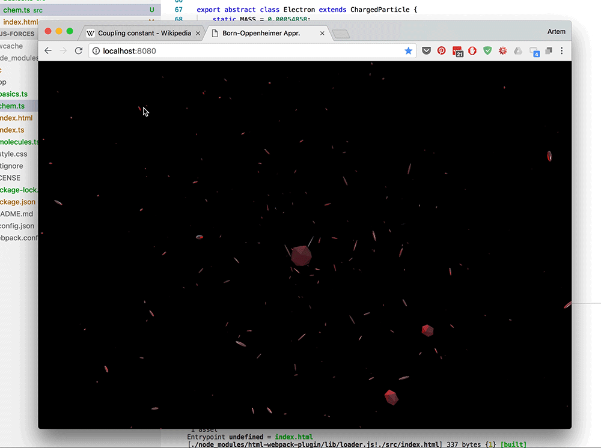

# Molecules


Molecule electron density - related experiments




## Useful Links:

- https://en.wikipedia.org/wiki/Density_functional_theory

- https://en.wikipedia.org/wiki/Many-body_problem

- https://en.wikipedia.org/wiki/Electron_localization_function


## Usage

### Install Typscript

```
npm install typescript -g
```

### Start

```
$ git clone https://github.com/compartia/molecules.git
$ cd molecules
$ npm install
$ npm start
```
